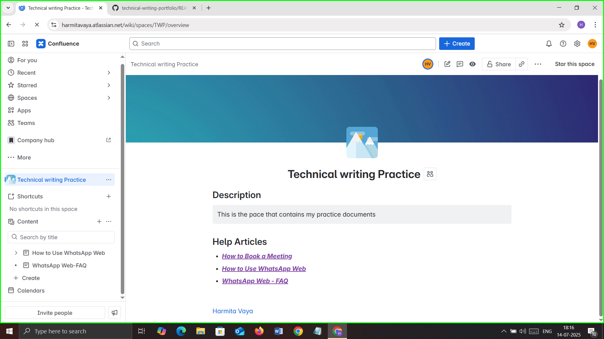

 📘 Technical Writing Portfolio

Welcome to my technical writing portfolio! This repository showcases my documentation projects built using professional tools and standards.

---

## 🧩 Confluence Project: WhatsApp Web Help Center

This is a simulated help center created in Confluence, structured like documentation you'd find in real SaaS platforms. It includes:

- ✅ Task-based guides (e.g., how to use WhatsApp Web)
- ✅ Concept pages
- ✅ An FAQ section
- ✅ Clear navigation and internal linking

👉 [📄 View project summary](whatsapp-help-summary.md)

📸 Screenshot of the Confluence space:

